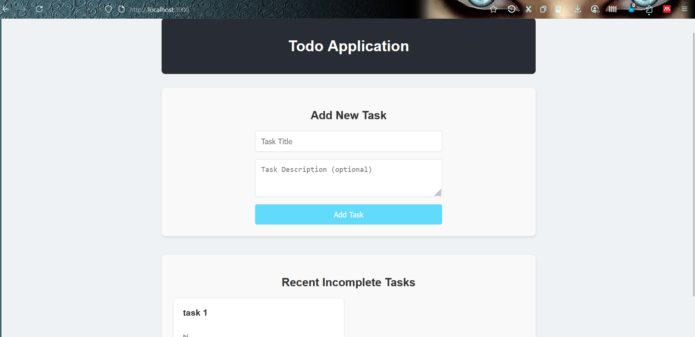
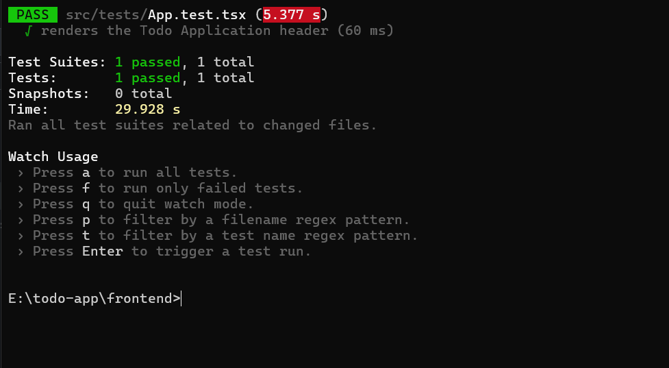
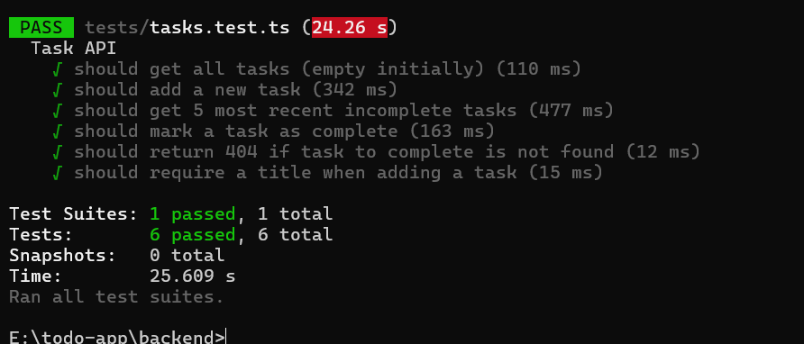

# 📝 Todo Application

A **full-stack Todo application** built with **React (TypeScript)** for the frontend, **Node.js (TypeScript + Express)** for the backend API, and **MySQL** for the database.
All services are containerized using **Docker** and orchestrated with **Docker Compose**.

---

## 📑 Table of Contents

* [✨ Features](#-features)
* [🧠 Technologies Used](#-technologies-used)
* [🛠️ Architecture Overview](#️-architecture-overview)
* [🖼️ Screenshots](#️-screenshots)
* [⚙️ Prerequisites](#️-prerequisites)
* [🚀 Getting Started](#-getting-started)
* [📡 API Endpoints](#-api-endpoints)
* [📁 Project Structure](#-project-structure)
* [🧪 Testing](#-testing)
* [💡 Development Notes](#-development-notes)
* [❓ Troubleshooting](#-troubleshooting)

---

## ✨ Features

✅ Add new tasks with a title and optional description
✅ View the 5 most recent incomplete tasks
✅ Mark tasks as complete
✅ Full-stack setup with Docker
✅ Unit and API testing for both frontend and backend

---

## 🧠 Technologies Used

### **Frontend**

* React (TypeScript)
* HTML5, CSS3
* Jest + React Testing Library

### **Backend**

* Node.js (TypeScript)
* Express.js
* MySQL2 (Promise-based)
* dotenv for environment configuration
* Jest + Supertest for backend testing

### **Database**

* MySQL 8.0

### **Containerization**

* Docker & Docker Compose
* Nginx for serving React production build

---

## 🛠️ Architecture Overview

```text
+-------------------+
|    React Frontend |
| (Nginx Container) |
|     Port 3000     |
+---------+---------+
          |
          v
+-------------------+
|   Node.js Backend |
| (Express + TS)    |
|     Port 5000     |
+---------+---------+
          |
          v
+-------------------+
|     MySQL DB      |
|   (Docker Image)  |
|     Port 3306     |
+-------------------+
```

---

## 🖼️ Screenshots


### 🖥️ Frontend UI


### ⚙️ Backend API Test


### 🧪 Jest Testing




---

## ⚙️ Prerequisites

Ensure you have the following installed:

* **Docker Desktop** → [Download Here](https://www.docker.com/products/docker-desktop)
* **Node.js v18+** (for local development/testing)
* **npm or yarn**

---

## 🚀 Getting Started

### Step 1️⃣ — Clone the Repository

```bash
git clone https://github.com/Aathi18/todo-app.git
cd todo-app
```

### Step 2️⃣ — Build and Run with Docker Compose

To start all services:

```bash
docker-compose up --build --force-recreate
```

🧹 For a clean rebuild (removes all images and volumes):

```bash
docker-compose down --rmi all --volumes
docker-compose up --build --force-recreate
```

### Step 3️⃣ — Access the Application

* Frontend → [http://localhost:3000](http://localhost:3000)
* Backend API → [http://localhost:5000](http://localhost:5000)
* API Route Example → [http://localhost:5000/api/tasks](http://localhost:5000/api/tasks)

---

## 📡 API Endpoints

### **GET /api/tasks**

Fetch the 5 most recent incomplete tasks.

**Response:**

```json
[
  { "id": 1, "title": "Sample Task", "description": "Optional", "is_completed": false }
]
```

### **POST /api/tasks**

Add a new task.

**Request:**

```json
{ "title": "New Task", "description": "Optional description" }
```

**Response (201):**

```json
{ "id": 1, "title": "New Task", "description": "Optional description", "is_completed": false }
```

### **PUT /api/tasks/:id/complete**

Mark a specific task as complete.

**Response:**

```json
{ "message": "Task marked as complete" }
```

---

## 📁 Project Structure

```
todo-app/
├── backend/
│   ├── src/
│   │   └── app.ts            # Main Express application
│   ├── dist/                 # Compiled JS output
│   ├── Dockerfile
│   ├── package.json
│   ├── tsconfig.json
│   ├── tests/                # Jest + Supertest files
│   │   └── tasks.test.ts
│   └── .env
│
├── frontend/
│   ├── src/
│   │   ├── App.tsx           # React UI
│   │   ├── App.css
│   │   ├── index.css
│   │   ├── tests/
│   │   │   └── App.test.tsx  # React Testing Library tests
│   ├── Dockerfile
│   ├── nginx.conf
│   └── package.json
│
├── docker-compose.yml
└── README.md
```

---

## 🧪 Testing

### 🧩 Frontend Tests

We use **React Testing Library** and **Jest**.

**Test File:** `frontend/src/tests/App.test.tsx`

```tsx
import React from 'react';
import { render, screen } from '@testing-library/react';
import App from '../App';

test('renders the Todo Application header', () => {
  render(<App />);
  const headerElement = screen.getByText(/Todo Application/i);
  expect(headerElement).toBeInTheDocument();
});
```

**Run Tests:**

```bash
cd frontend
npm install
npm test
```

---

### ⚙️ Backend Tests

We use **Jest** and **Supertest** to test the API routes.

**Test File:** `backend/tests/tasks.test.ts`

```ts
import request from 'supertest';
import { app } from '../src/app';

describe('Task API', () => {
  it('should get all tasks (empty initially)', async () => {
    const res = await request(app).get('/api/tasks');
    expect(res.statusCode).toBe(200);
    expect(res.body).toEqual([]);
  });

  it('should add a new task', async () => {
    const res = await request(app).post('/api/tasks').send({
      title: 'Test Task 1',
      description: 'This is a description for test task 1.',
    });
    expect(res.statusCode).toBe(201);
    expect(res.body).toHaveProperty('id');
  });
});
```

**Run Tests:**

```bash
cd backend
npm install
npm run test
```

---

## 💡 Development Notes

* Frontend and Backend both support **hot-reload** with Docker volumes.
* MySQL data persists between container restarts using `db_data` volume.
* Update `.env` in the backend to configure DB credentials.

---

## ❓ Troubleshooting

### ❌ Frontend Shows “Failed to Fetch Tasks”

* Ensure backend is running (`docker ps` → check backend container).
* Verify `nginx.conf` in frontend has:

  ```
  location /api {
      proxy_pass http://backend:5000;
  }
  ```
* Rebuild frontend:

  ```bash
  docker-compose up --build frontend
  ```

### ❌ Backend Crashes on Start

* Ensure `.env` has correct DB values:

  ```
  DB_HOST=db
  DB_USER=user
  DB_PASSWORD=password
  DB_NAME=tododb
  ```
* Rebuild backend:

  ```bash
  docker-compose up --build backend
  ```

---

## 🧾 License

This project is licensed under the **MIT License**.
© 2025 Your Name — All rights reserved.
